# This is a repo for me to learn basic kubernetes and helm

- We will learn about how to work with kubernetes and basics of helm

# What is Kubernetes?
- Open source container orchestration tool
- Developed by Google
- Helps mange containerized applications in different deployment environments

## What does Kubernetes solve?
- With the rise of the need for a container orchestration tool
- the trend from **Monolith** to **Microservice**
- Increased usage of **containers**

## Features orchestration tool offer
- **High availability** or no downtime
- **scalability** or high performance
- **Disaster Recovery** - backup and store

# Kubernetes Components

## Node and Pod

### Node

A **node** is a **physical** or **virtual** machine that runs as part of a Kubernetes cluster. Nodes are the **workers** that **execute** the applications and workloads orchestrated by Kubernetes

Node Types: There are typically two types of nodes:

1. **Master Node**: *Manages* the cluster and *orchestrates* the scheduling and scaling of applications. It runs **critical** components like the **API server**, **scheduler**, and **controller manager.**

2. **Worker Node**: *Executes* the applications and workloads. It runs components like the **kubelet**, **kube-proxy**, and **container runtime** (e.g., Docker).

### Pod

A **pod** is the smallest and simplest unit in the Kubernetes object model that you can create or deploy. A pod represents a **single instance of a running process in a cluster**

- smallest unit of k8s
- abstraction over container
- usually 1 application per Pod
- each pod gets its own ip address
- each pod is ephenemeral, therefore the ip address might be assigned a new one if it dies

## Services and Ingress

### Service

Service is an abstraction that defines a logical set of Pods and a policy by which to access them. Services **enable communication** between **different components** of an application or between **different applications** within the cluster

- It provides permanent IP address that can be attached to each pod
- lifecycle of Pod and Service NOT connected
    - meaning that if the pod dies, the service and its ip address will stay
- There is external Service as well
    - There is another component called Ingress, whcih can help to help forwarding the request to your service

## ConfigMap and Secrets

### ConfigMap
- external configuration of your application, such as database url

### Secrets
- however, we don't store username and password inside configMaps, instead we store it in secrets
- it is used to store secret data
- it is base64 encoded

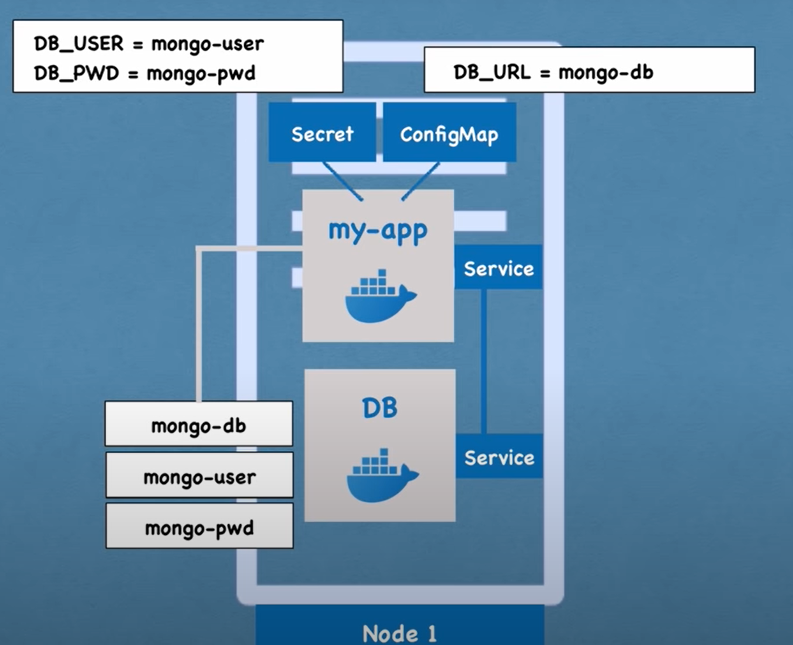

## Volumes

**Volumes** are used to **manage** and **persist** *data* in a containerized environment. They provide a way to store data that is **independent** of the container lifecycle, ensuring **data persistence** beyond the lifespan of individual containers or Pods

### Volume as data storage
- attaches a physical hardrive/storage to your pod
    - it can be a storage on local machine
    - or even remote, outside of the k8s cluster
- please **note** that *K8s* **doesn't manage data persistent**, so we should manage it ourselves, store it somewhere, or even backing it up, making sure it is stored on **proper hardware**

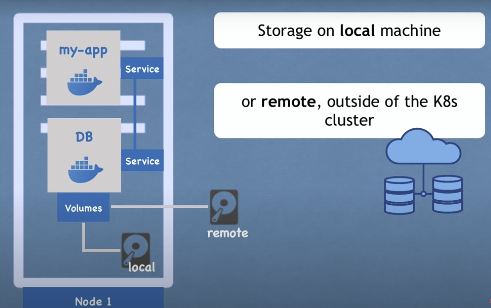

## Deployment and StatefulSet

There is a case that a pod dies, then we couldn't access to our service, therefore normally we will replicate everything instead of 1

- Note that the **replica** is **connected** to the **same service**
- Here, service works as **permanent ip address** and also **load balancer**
- this is actually a blue-print of deployment

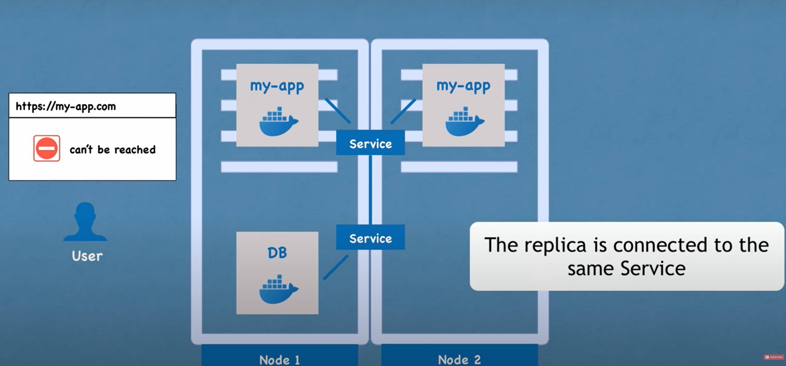

- we can **keep a note** here that **DB can't be replicated** via **deployment** as it is stateful, *Deployment* is only for **stateless application**

### StatefulSet
StatefulSet comes in handy when dealing with stateful application such as DB

- note that deploying StatefulSetis not easy in k8s, that's why it is a common practice to host database application outside the cluster

## Main Kubernetes Components Summarized
- pod
    - abstraction of containers
- service
    - communication
- ingress
    - route traffic into cluster
- configMap & secrets
    - external configuration
- volumes
    - data persistent
- deployment & statefulset
    - pod blue-print with replicating mechanism

# Minikube & Kubectl

## Minikube
- it is a test/local cluster setup
- unlike production setup, we normally have two master node, and multiple worker nodes
- in local setup (minikube), we actually had the master and node processes run on **ONE MACHINE**
- we can say that minikube is a 1 node k8s cluster

## Kubectl

kubectl is the command-line tool used to **interact** with a **Kubernetes cluster**. It allows **administrators** and **developers** to **deploy** applications, **inspect** and **manage cluster resources**, and **view logs** of running applications

## Installation - minikube

we can install it via kubernetes.io

- to create a cluster, we can use:

<!-- > minikube start -->
> minikube start --driver=docker
> minikube update-check
> minikube stop
> minikube delete

# External Service vs Ingress

- note that ip adresses should not be opened, therefore, we need ingress

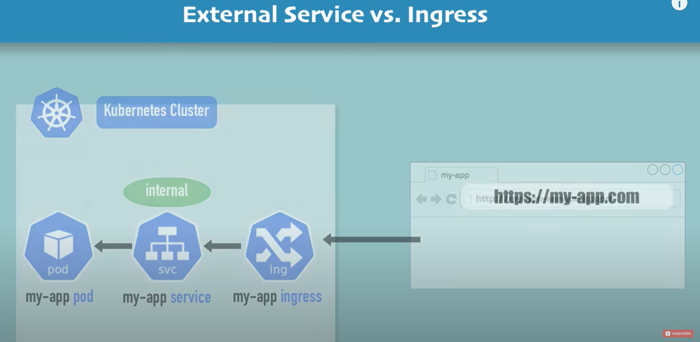

we need ingress controller to evaluate all the rules that we defined

- there are many different ways to work with ingress controller, can watch youtube for explanation again: https://www.youtube.com/watch?v=X48VuDVv0do&t=371s
- to enable ingress in minukube, we can use:
> minikube addons enable ingress

# Helm Package Manager

## What is Helm
- package manager for kubernetes
    - to package YAML files and distribute the in public and private repositories

## What is Helm Charts
- Bundle of YAML files
- you can create your own Helm Charts with Helm
- push them to Helm Repository
- Download and use existing ones
- there are two types of registries
    1. public registries
    2. private registries
        - share within organizations
- it works as templating engine
    1. define a common blueprint
    2. dynamic values are replaced by placeholders
- it is practical for CI/CD
    - in your build, you can replace the values on the fly

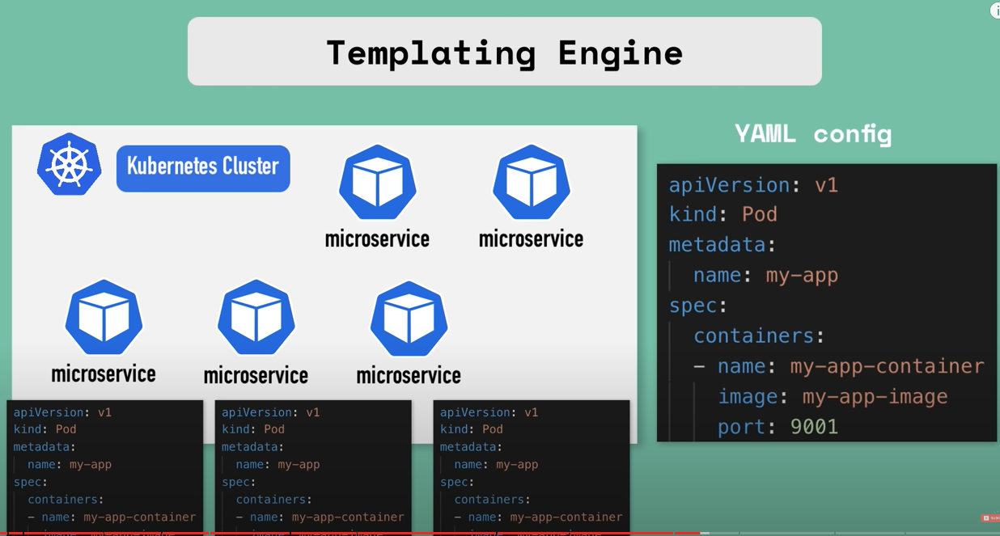

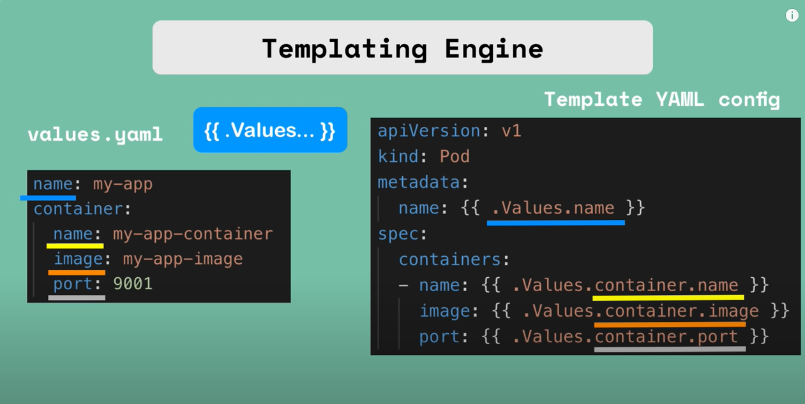

## Helm Chart Structure
- Directory structures:
    1. Top level *mychart* folder => name of chart
    2. **Chart.yaml** => meta info about chart
    3. **values.yaml** => values for the template files
    4. *charts* folder => chart dependencies
    5. *templates* folder => the actual template files

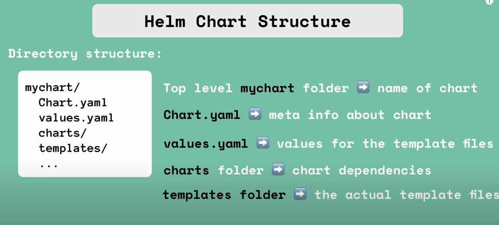

- we can make use of command
> helm install <chartname>

### Values injection into template files
- it will be merged
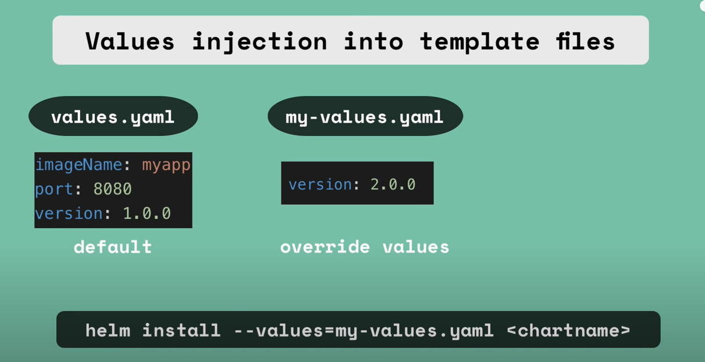

### Release management
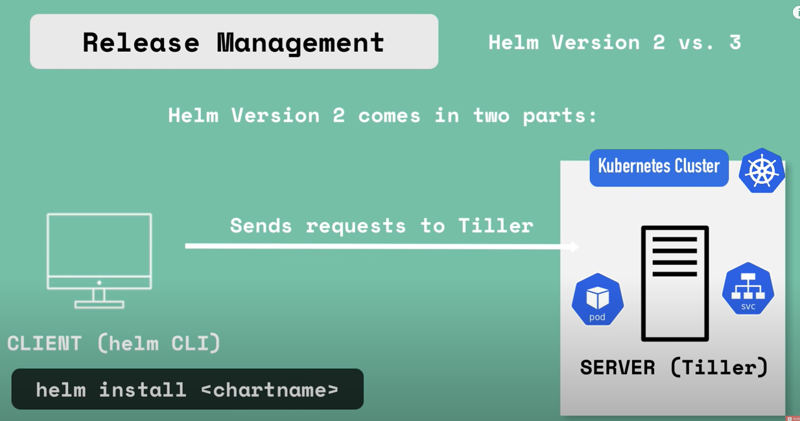

# Kubernetes Volumes
- In this section, we will talk about how to **persist data** in Kubernetes using volumes
- We need volumes because k8s did not persist data out of the box, we actually need a storage that **doesn't depend on** the **pod lifecycle**
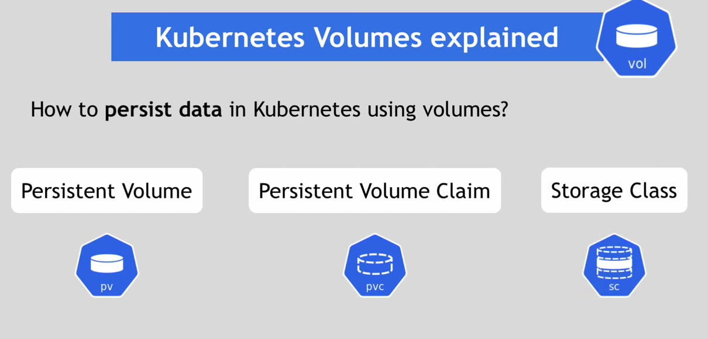

## Storage Requirements
1. Storage that **doesn't depend on** the **pod lifecycle**
2. Storage must be **available on all nodes**
3. Storage needs to **survive** even if **cluster crashes**

## Another use case for persisten storage
- when we need to have directories to store configuratio files, or read/write files
- in this case, we need persistent volume

## Persistent Volume
- a cluster resource
- created via YAML file
    - kind: PersistentVolume
    - spec: e.g. how much storage?
- needs actual storage
- but where does this storage comes from? and who make it available to the cluster?
- we need to know **what type of storage** do you need?
- and we need to **create and manage** them by ourselves

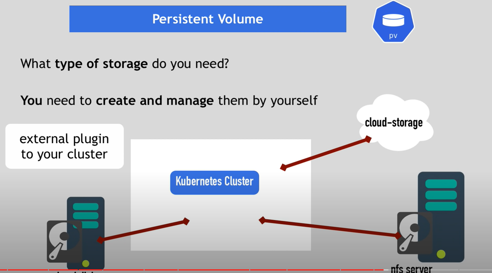

## Persistent Volume YAML Example
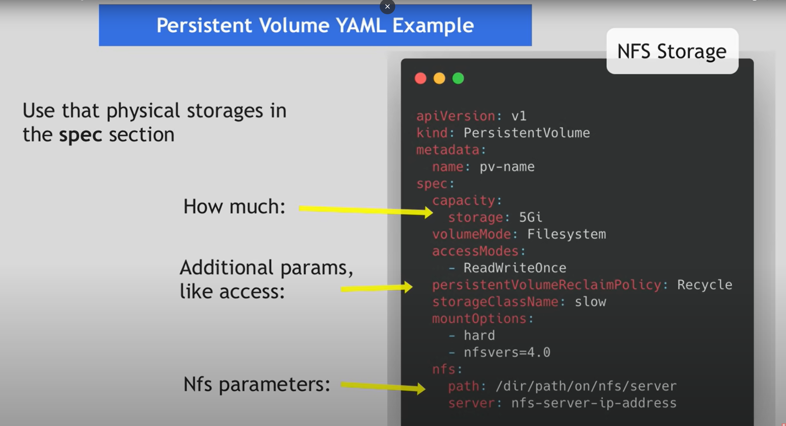

## persistent Volumes are NOT namespaced
- PV is **outside** of the namespaces
- it is **accessible** to the **whole cluster**

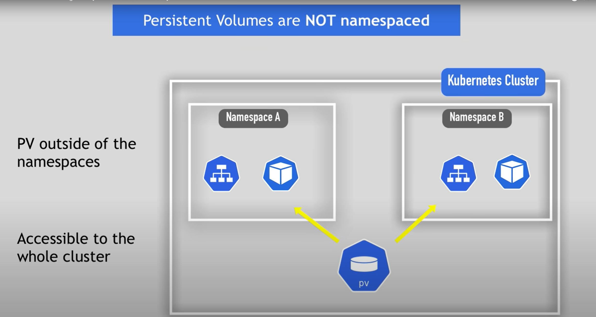

## Local vs Remore Volume Types
- Each volume type has it's own use case!
- Local volume typesviolate 2. and 3. requirement for data persistence:
    1. being tied to 1 specific node
    2. surviving cluster crashes
- Therefore, we could say for db persistence, we always use remote storage instead!

## Levels of Volume abastractions
- claim must be in the same namespace

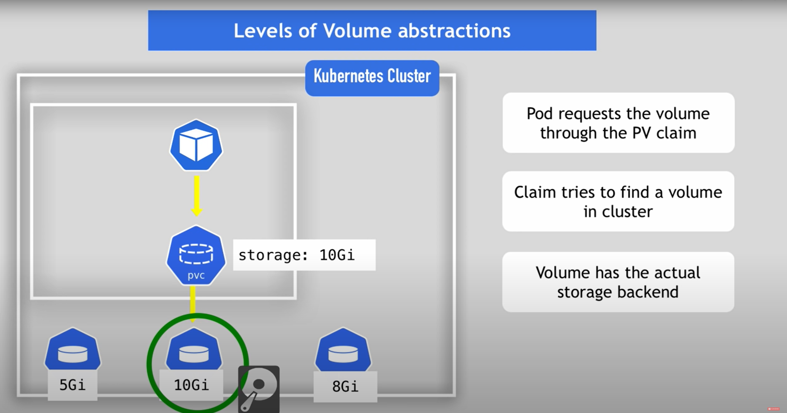

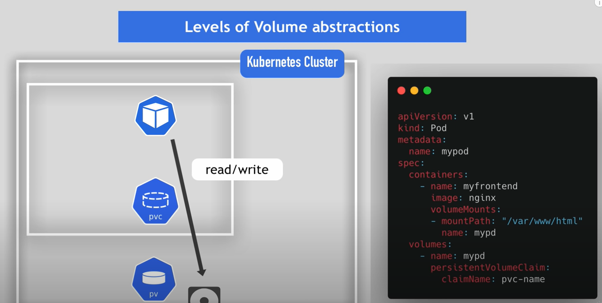

## Summary
- Volume is directory with some data
- These volumes are accesible in containers in a pod
- How made available, backed by which storage medium
    - defined by specific volume types

## Storage class
- Storage class provisions Persistent Volumes **dynamically**... when PersistentVolumeClaim claims it
- Storage is defined in the StorageClass component
    - via **"provisioner"** attribute
    - each storage backend has own provisioner
    - **internal** provisioner - "kubernetes.io"
    - **external** provisioner
    - we can configure **parameters** for storage we want to request for PV
- work as another abstraction level
    - abstracts underlying storage provider
    - parameters for that storage

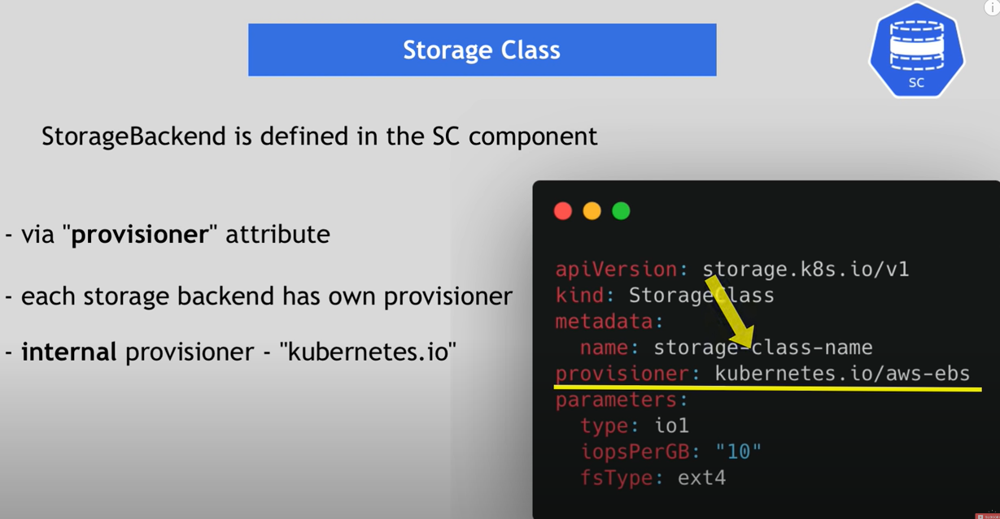

### Storage Class usage
- Requested by PersistentVolumeClaim

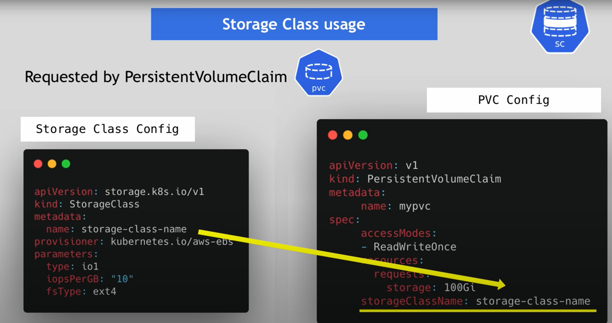

- steps of strage class and pvc

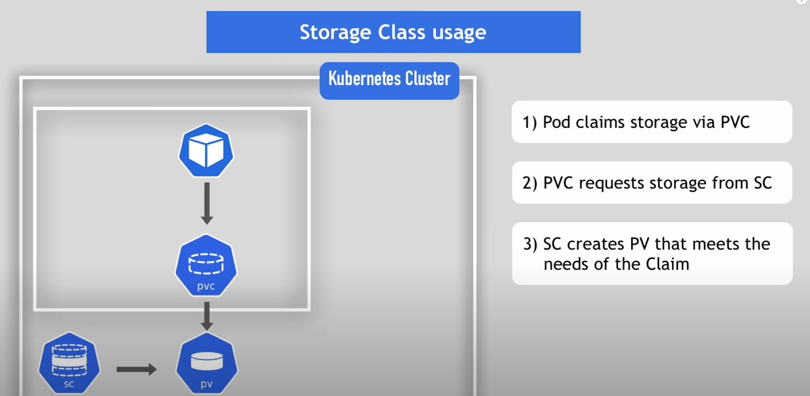