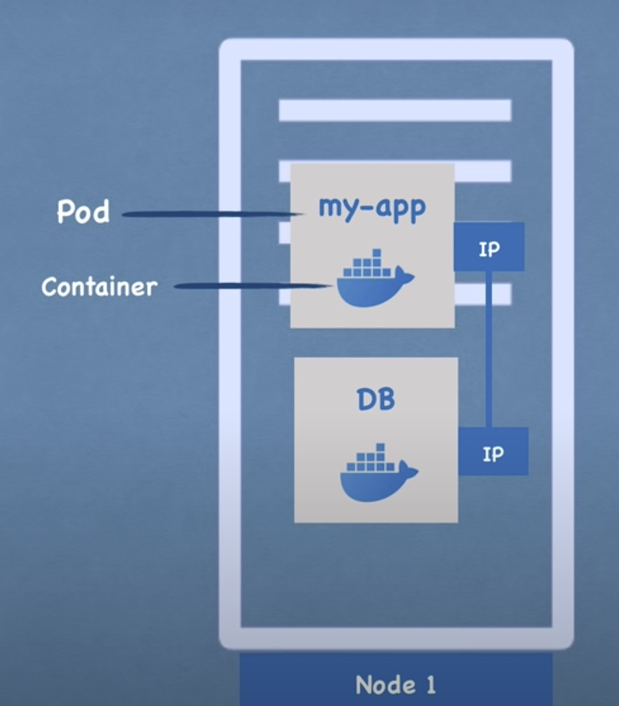
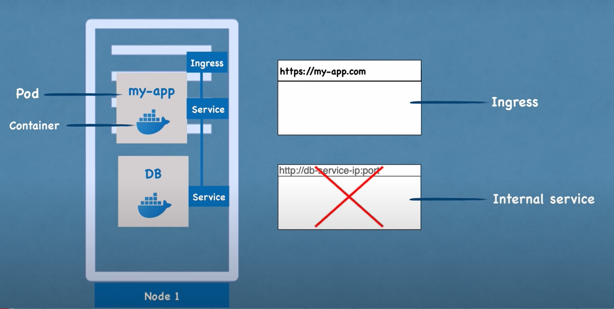

# This is a repo for me to learn basic kubernetes and helm

- We will learn about how to work with kubernetes and basics of helm

# What is Kubernetes?
- Open source container orchestration tool
- Developed by Google
- Helps mange containerized applications in different deployment environments

## What does Kubernetes solve?
- With the rise of the need for a container orchestration tool
- the trend from **Monolith** to **Microservice**
- Increased usage of **containers**

## Features orchestration tool offer
- **High availability** or no downtime
- **scalability** or high performance
- **Disaster Recovery** - backup and store

# Kubernetes Components

## Node and Pod

### Node

A **node** is a **physical** or **virtual** machine that runs as part of a Kubernetes cluster. Nodes are the **workers** that **execute** the applications and workloads orchestrated by Kubernetes

Node Types: There are typically two types of nodes:

1. **Master Node**: *Manages* the cluster and *orchestrates* the scheduling and scaling of applications. It runs **critical** components like the **API server**, **scheduler**, and **controller manager.**

2. **Worker Node**: *Executes* the applications and workloads. It runs components like the **kubelet**, **kube-proxy**, and **container runtime** (e.g., Docker).

### Pod

A **pod** is the smallest and simplest unit in the Kubernetes object model that you can create or deploy. A pod represents a **single instance of a running process in a cluster**

- smallest unit of k8s
- abstraction over container
- usually 1 application per Pod
- each pod gets its own ip address
- each pod is ephenemeral, therefore the ip address might be assigned a new one if it dies

## Services and Ingress

### Service

Service is an abstraction that defines a logical set of Pods and a policy by which to access them. Services **enable communication** between **different components** of an application or between **different applications** within the cluster

- It provides permanent IP address that can be attached to each pod
- lifecycle of Pod and Service NOT connected
    - meaning that if the pod dies, the service and its ip address will stay
- There is external Service as well
    - There is another component called Ingress, whcih can help to help forwarding the request to your service

